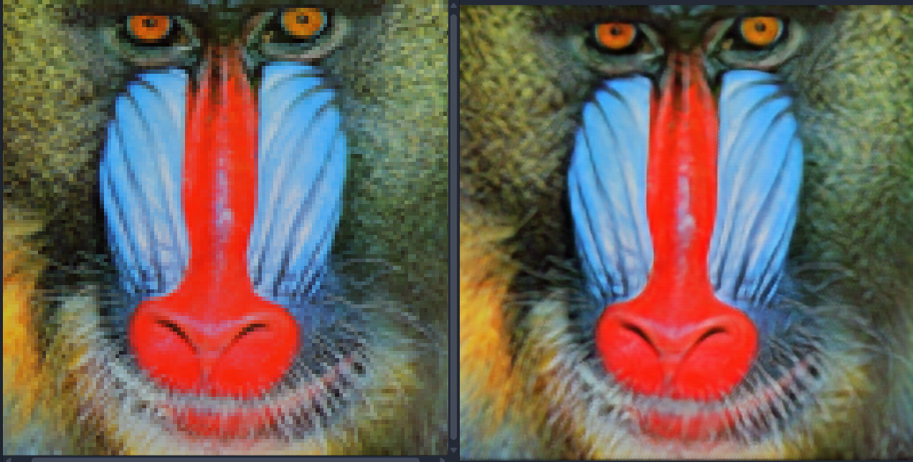
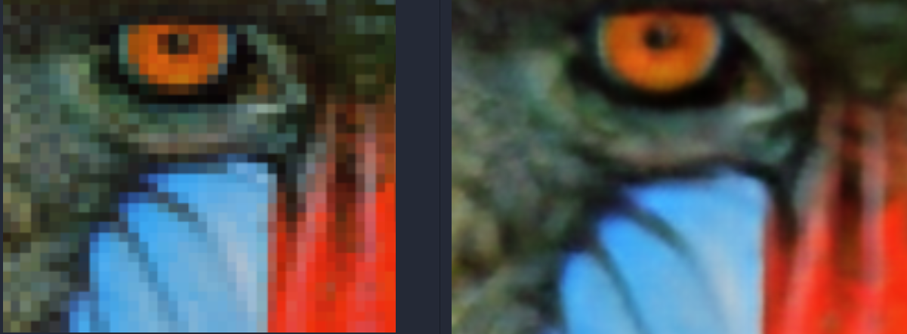

# SRGAN Implementation

This repository contains my custom implementation of **Super-Resolution Generative Adversarial Network (SRGAN)** based on the original paper *"Photo-Realistic Single Image Super-Resolution Using a Generative Adversarial Network"* by Ledig et al.

Although trained briefly on a home GPU setup, the results are promising and demonstrate clear improvements over the low-resolution inputs.

---

## 🚀 Features

* Full **SRGAN Generator + Discriminator** implementation
* Perceptual loss (VGG-based) support
* PatchGAN-style discriminator
* Simple training loop for quick experimentation
* Inference script with image loading + saving

---

## 📸 Example Result

Below is an example result on the classic *Baboon* test image.

**Input (Low Resolution(resized for side by side)) vs Output**


---


## 📂 Project Structure

```
├── src/
│   ├── generator.py
│   ├── discriminator.py
│   ├── dataset.py
│   ├── train.py
│   ├── inference.py
|   ├── utils.py
├── README.md
└── requirements.txt
```

---

The training script supports resume, checkpointing, and mixed precision (optional).

---

## 🖼️ Inference

```
python inference.py --img_path baboon.png
```

Outputs will be stored inside `src/`.

---

## ⚙️ Requirements

```
torch
torchvision
numpy
Pillow
opencv-python
albumentation
```

Install all dependencies:

```
pip install -r requirements.txt
```

---

## 🙌 Acknowledgements

Inspired by:

* SRGAN Paper
* ESRGAN improvements

If you have suggestions for improving this implementation or want a version with ESRGAN, Real-ESRGAN, or SwinIR, feel free to open an issue!
